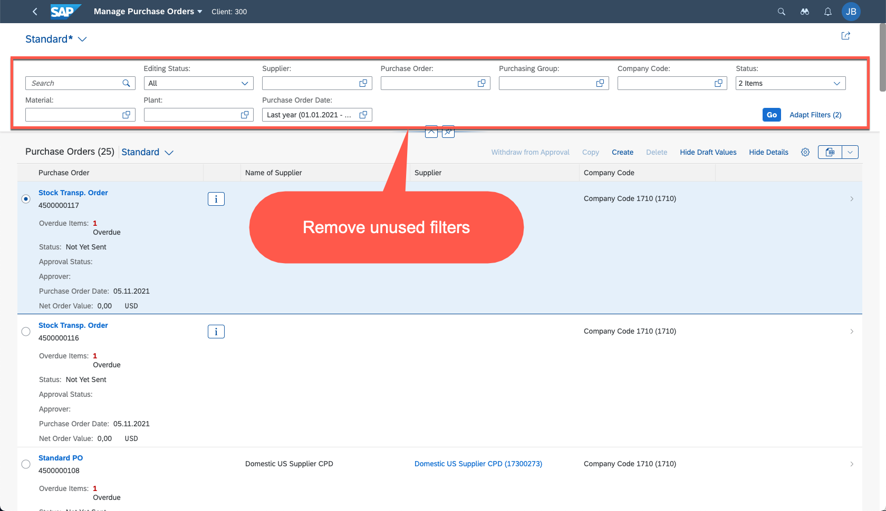
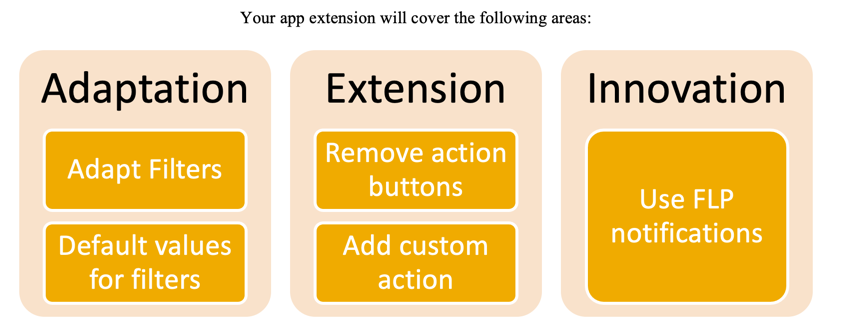

# 5 Steps to Fiori - List Report Extension

## Description

This repository contains the material for Developer Work Package 5 of the 5 Steps to Fiori for customers training.  

## Overview
As part of your current Purchase Order Processing business process, you run a revision of all created Purchase Orders. In your previous ECC system, when running this review, a user had to run an ABAP report to obtain all Purchase Orders with status “Sent” or ”Not Yet Sent” and once information was available this user had to send an email to the user that created the Purchase Order to speed-up the processing.

The process of sending emails is a manual activity and the success rate of the responsible user reacting to the email is low as some users have even created email routines to ignore these email messages.

Once you move to S/4HANA, your business requests you to develop a similar functionality using SAP Fiori apps (note that you could find this same business requirement in a new implementation or a system conversion to SAP S/4HANA).

While running the exploration phase of your implementation project, one of the users that runs the Purchase Order review process mentions that app Manage Purchase Orders already shows some of the information they use to decide when to send an email. If this were to be the app used for this scenario a couple of modifications would be needed. The user lists the possible changes as follows:

1.	Remove unused filters
2.	Set default values for filters:
	   - Status = Sent, Not Yet Sent
     - Purchase Order Date = Last year* (for testing purposes)

    

3.	Remove unused actions
4.	Possibly replace one of these buttons with a feature to send an email

    

## Proposed Solution
Overall, you could consider the following options:

- Requirements 1 and 2
For these changes you have already become familiar with the UI adaptation features in WP04_D where you created an application variant to remove filters and set default values to a variant. Proposed solution for these requirements is to use adaptation options.

- Requirements 3 and 4
These requirements involve changing the layout and the code of the standard application so adaptation would not be enough, these requirements need code extensions which can only be achieved by using SAP Business Application Studio and the UI Extension options this tool offers.

- Requirement 4
As mentioned earlier, there is already some precedence of the email notifications being ignored by most users meaning you could use this as an opportunity to introduce innovations to the business process via the new features in SAP Fiori. One option is to use the notifications feature in the Fiori Launchpad as it would immediately become visible to the user and will allow them to easily navigate to the object that needs their attention.

    

## Requirements

The requirements to follow the exercises in this repository are:

* You have installed the _latest_ ABAP Development Tools (ADT), see [ABAP Development Tools](https://tools.hana.ondemand.com/#abap)
* You have an SAP S/4HANA 2021 or 2020 system deployed in an on-premise Sandbox or via SAP Cloud Application Library (CAL)

## Exercises

Follow these steps to extend standard app Manage Purchase Orders using Business Application Studio.
* [Exercise 0 - Understanding SAP Fiori Notification Framework](exercises/ex_0)
* [Exercise 1 - Developing and testing a custom Notification Provider](exercises/ex_1)
* [Exercise 2 - Triggering Notifications from an OData service](exercises/ex_2)
* [Exercise 3 - Adaptation - Extending List Report using Adaptation Project](exercises/ex_3)

## How to obtain support

Support for the content in this repository is available during the actual time of the online session for which this content has been designed.

## License
Copyright (c) 2022 SAP SE or an SAP affiliate company. All rights reserved. This file is licensed under the Apache Software License, version 2.0 except as noted otherwise in the [LICENSE](LICENSES/Apache-2.0.txt) file.
