# EXTENSION – ADDING CUSTOM ACTIONS TO A LIST REPORT USING ADAPTATION PROJECT

## Introduction
In this section you will add the required modifications to enable an additional action in the List Report table header. Before you start, please be aware that we will not provide detailed explanations of what is occuring at runtime. To properly understand how the code in an extension works you must become familiar with the following concepts:

* DOM Manipulation
* SAPUI5 Controller Lifecycle Methods
* MVC (Model, View Controller)
* Controller
* Controller Extensions
* Data binding
* Fragments
* Unique ID‘s
* Modules and Dependencies

**In this section we will first have you create all objects so you familiarize with the features and in the next section we will explain the code.**

## Add Fragment
Open Visual Editor in Edit mode, right-click the area next to the button with text “Show Details” and select option Add fragment.

  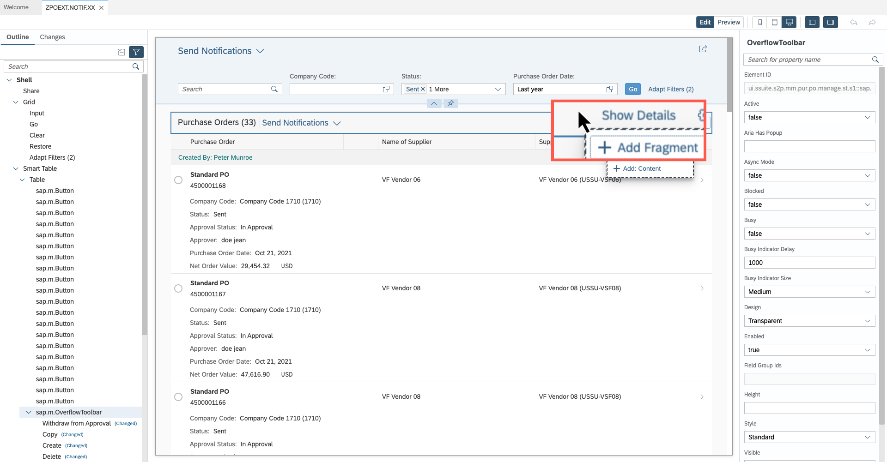

In the pop-up screen enter the following information and click on Create New:

**Target Aggregation: Content**
**Index: 9**

  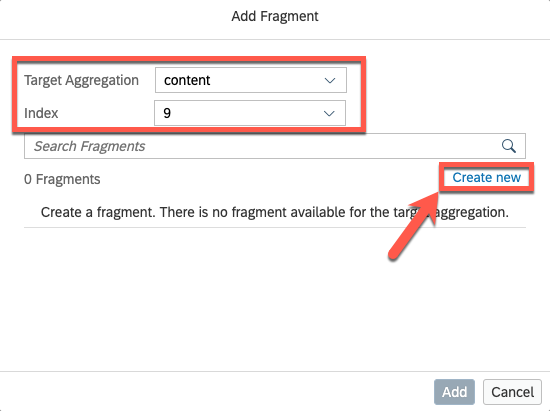

Enter the name of the fragment where XX represents your developer ID and click on Create:

**Fragment Name: extManagePONotification_XX**

A new screen to add the xml structure of the fragment will be shown.

  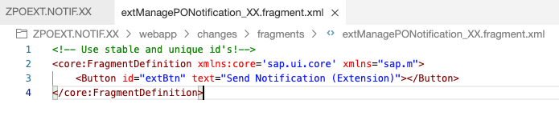

Save your file and re-launch Visual editor. You will notice a new button is visible in your customized app

  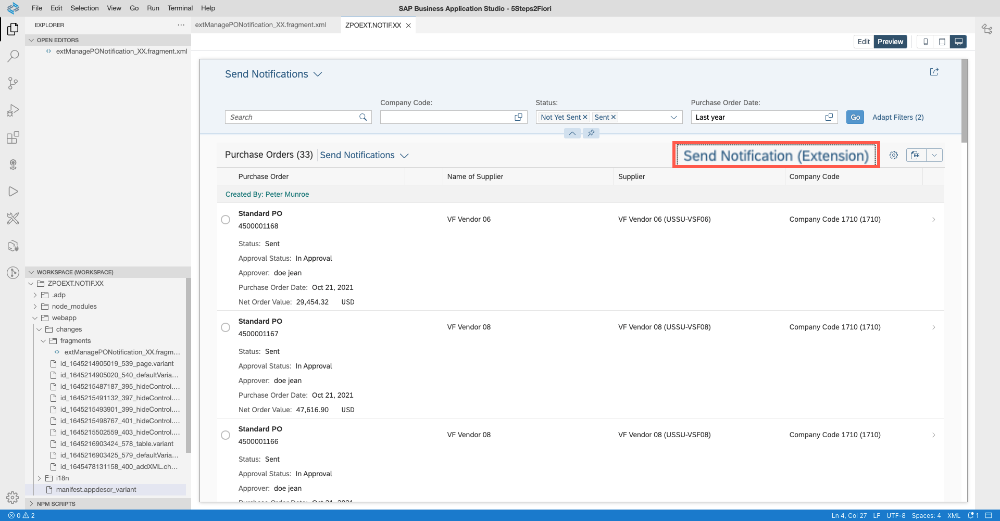

## Extend Controller

Right-click on the area next to your custom button and select option Extend with Controller.

  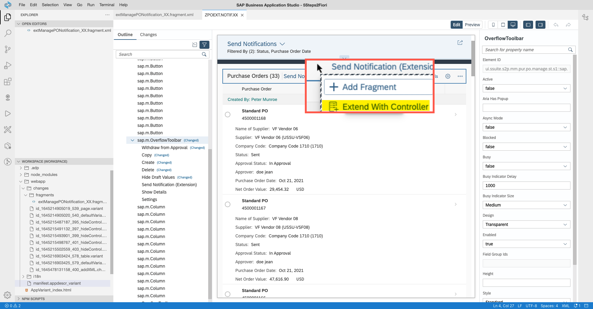

Enter controller name where XX represents your developer ID and click on Extend:

**Controller Name: extManagePONotification_XX**

  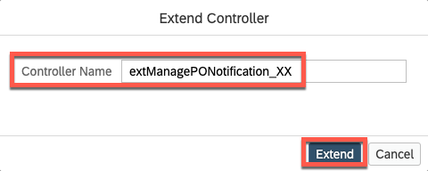

A new file will be created, in here you will be adding code for your extension, copy the code from this sample into your project. Reference file is available here.

  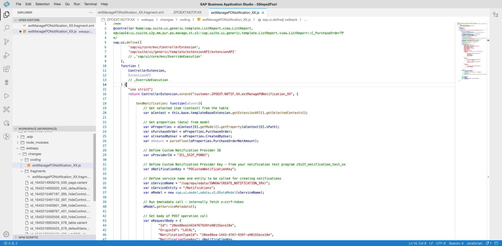

Go back to the definition of your fragment and bind your code to the Press event of the button

  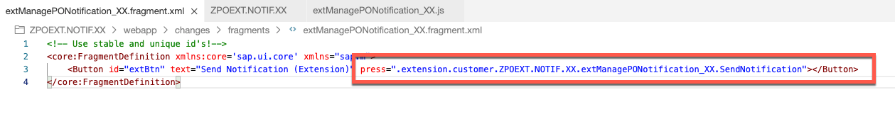

Re-launch Visual Editor. Once the tool is reloaded **select any item from the list and press button Send Notification (extension)**, you should see a message showing the notification has been sent to the PO creator.  

  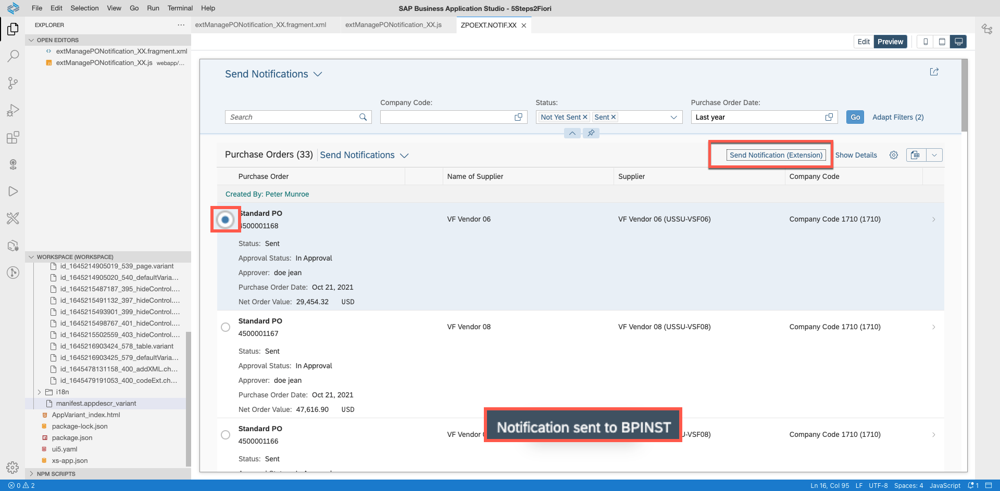

### Confirm extension is working
Logon to the SAP Fiori launchpad of the Purchase Order creator and you should find a new notification

  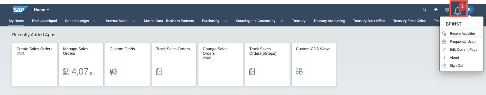

Display the notification. You should see the text defined in your notification provider.

Notice that the message now includes the number of the Purchase Order that needs to be reviewed. This was calculated by the code in the controller extension.

  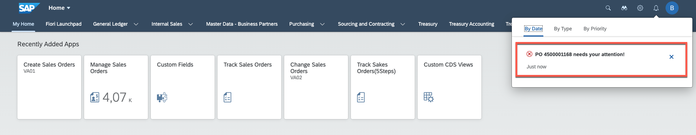

Click on the notification text. You should then navigate to the detail view of the Purchase Order (regardless of the order being created in SAP GUI for HTML or SAP Fiori you will navigate to the detail view).

  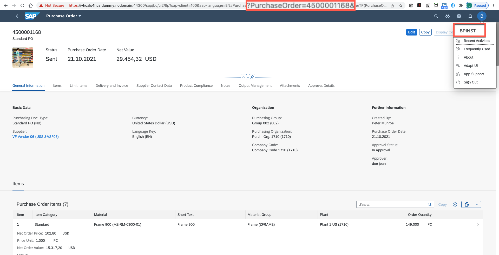

**Try sending another notification and see the differences**

## Conclusion
You have now created a controller extension and added custom code to trigger a notification from the extension. In the next section you will get a deep dive into the code so you understand how the extension is behaving at runtime.
