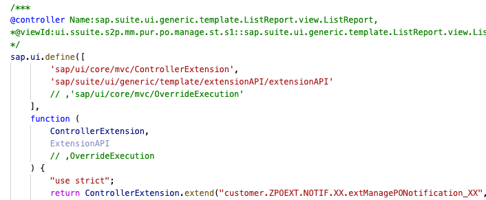
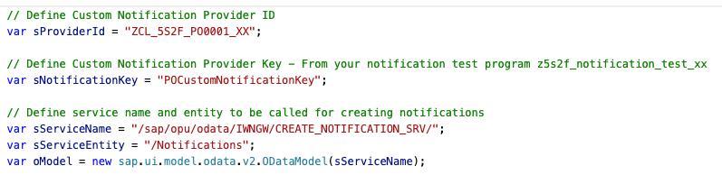
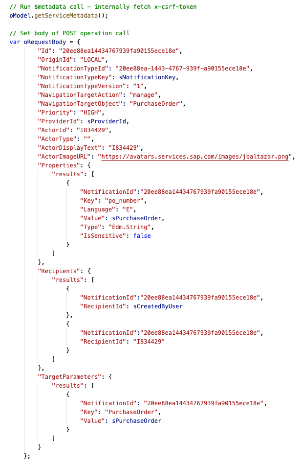
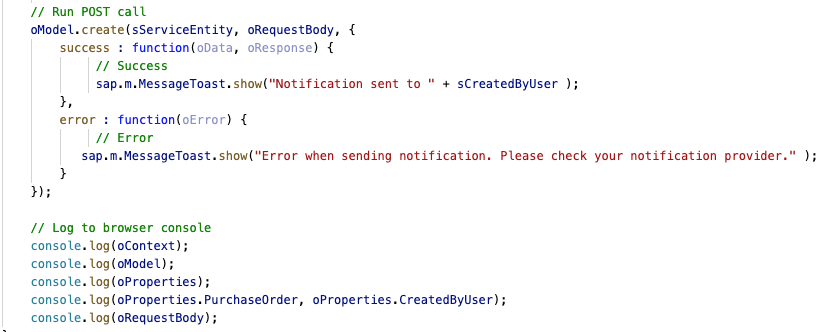

# EXTENSION – UNDERSTANDING THE CODE

## Introduction
In this section we will explain, at a very high level, what the code in your extension is doing.

## Fragment.xml

### In the fragment you define:

  

- **Source library from where the control is loaded**:
  sap.m which holds controls for consumption on mobile devices.
- **Control ID**:
  “Stable ID” for the control, this ID must be unique
- **Event Binding**:
    On the button metadata you define which function is called for each of the available events, in this case the event “Press” is bound to your custom javascript function: “SendNotification”. In controller extensions, you should always call your functions with notation:

      **.extension. + “your project name” + “.” + “your custom function name”**

## Controller.js

### In this section of the controller, you define:

  

- Creation of 1 main JavaScript module along with dependencies.
- This module makes use of the base class for  Controller Extensions and accesses the extension API for Smart Template Application development.
- Declare the main component “customer.ZPOEXT.NOTIF.XX.extManagePONotification_XX” which should hold all the new code
- “Use Strict” is a JavaScript standard that helps build cleaner code as it prevents you from using undeclared variables, by adding it to the definition of your component you are accepting this standard (most common syntax to define a variable is using syntax: var <anything>)

### In this section of the controller, you define:

  

- Declare your custom function SendNotification which receives information of the Event who triggered the execution with object oEvent (try seeing what the event holds by logging the variable to the console).
- Identify the context of the action by using the Extension API. As you are working with a fragment and cannot access model data directly you need to use Extension API to obtain information of the object that is selected in the table via function getSelectedContext.
- Once you have obtained Context information you need to obtain the value of the properties from the entity that was selected in the table. At this moment you are not running any additional OData requests but rather using the values of the model that is stored in your client (browser). This allows you to obtain the values for the selected Purchase Order, Purchase Order creator or any other value you might need.

### In this section of the controller, you define:

  

- Name of the Custom Notification Provider that will be used to create the notification along with a notification key (same value as the one defined in your notification test program).
- Relative path to the CREATE_NOTIFICATION Odata service along with the entity to be used for the HTTP POST operation. This will be used to instantiate a new OData model which triggers a call to this service.

### In this section of the controller, you define:

  

- Initial web request for service metadata of CREATE_NOTIFICATION service and storage of x-csrf-token.
- Payload of the notification using a generic template, notice that the ID’s a re GUID’s and don’t require a specific value, your custom notification provider will create correct ID’s at runtime, however, the payload requires these values to not be empty.
- Values of the Notification provider and notification key in the payload.
- In the Properties section you are defining the values that wil be passed to your notification provider so your notification message will be adjusted with the values from these parameters.
- In the Recipients section you add all user ID’s that will receive the notification. There are two recipients defined so you can add your own ID and test reception of notifications rather than log to different launchpads.
- In the target parameters section, you add the values of the parameters that will be added to the target application defined via the Navigation Target Semantic Object and Action. The combination of these parameters tells the SAP Fiori Launchpad which app to open long with the required object to be displayed in the app.

### In this section of the controller, you define:

  

- HTTP POST call to the CREATE_NOTIFICATION service along with the required payload. You are additionally defining asynchronous callback functions for the success and error events, so you receive a message depending on the result.
- Log section – These last entries aim to help you see all the information that is available to you while running the code. All this information is displayed in your browser’s console log.

## Conclusion
You have now identified the mayor sections of the code you've added to your extension and the main activities run in each section. If you need additional details on the code, contact your trainers through your team lead to setup a 1:1 session.
